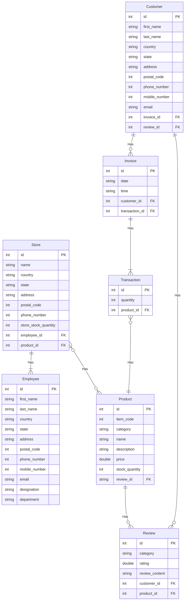

```mermaid
erDiagram
    Customer {
        int id PK
        string first_name
        string last_name
        string country
        string state
        string address
        int postal_code
        int phone_number
        int mobile_number
        string email
        int invoice_id FK
        int review_id FK
    }

    Employee {
        int id PK
        string first_name
        string last_name
        string country
        string state
        string address
        int postal_code
        int phone_number
        int mobile_number
        string email
        string designation
        string department
    }

    Invoice {
        int id PK
        string date
        string time
        int customer_id FK
        int transaction_id FK
    }

    Review {
        int id PK
        string category
        double rating
        string review_content
        int customer_id FK
        int product_id FK
    }

    Product {
        int id PK
        int item_code
        string category
        string name
        string description
        double price
        int stock_quantity
        string review_id FK
    }

    Store {
        int id PK
        string name
        string country
        string state
        string address
        int postal_code
        int phone_number
        int store_stock_quantity
        int employee_id FK
        int product_id FK
    }

    Transaction {
        int id PK
        int quantity
        int product_id FK
    }

    Customer ||--O{ Review : "Has"
    Customer ||--O{ Invoice : "Has"
    Invoice ||--|{ Transaction : "Has"
    Product ||--O{ Review : "Has"
    Store }O--O{ Product : "Has"
    Store ||--|{ Employee : "Has"
    Transaction }O--|| Product : "Has"
    %% Employee |O--O{ Employee : "Manages"
```
